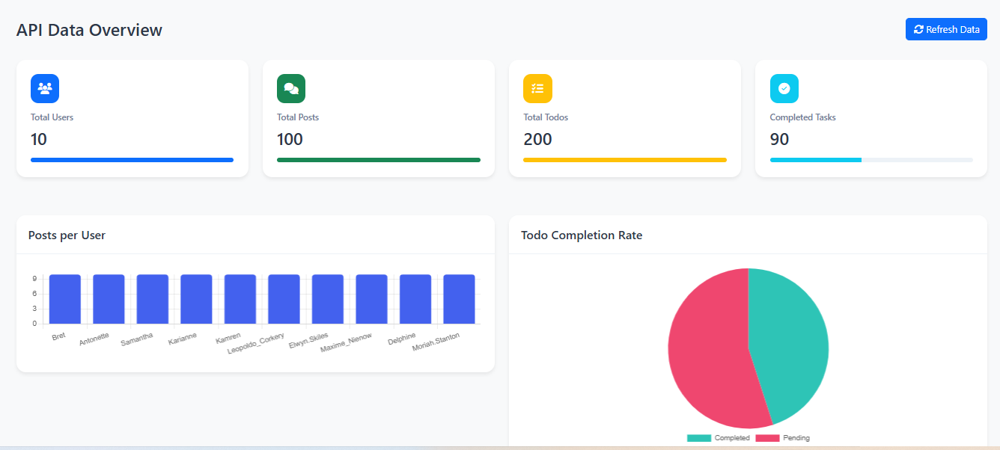
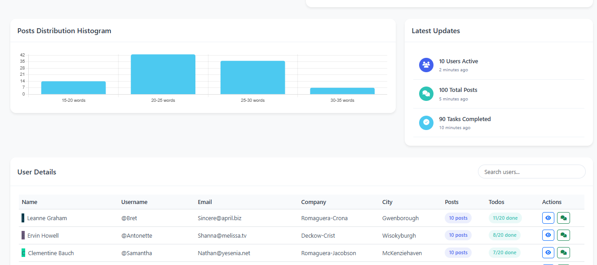
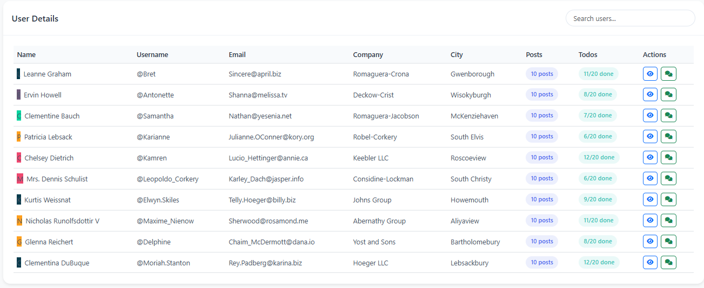

---

# API Analytics Dashboard

A simple web-based dashboard that visualizes data fetched from the JSONPlaceholder API. It includes interactive charts, summary cards, and a detailed user table. The dashboard provides insights on total users, posts, todos, and more.

## Features

- **Summary Cards**: Displays total users, posts, todos, and completed tasks with progress bars.
- **Interactive Charts**: Visualizes:
  - Posts per User (Bar chart)
  - Todo Completion Rate (Pie chart)
  - Posts Distribution (Histogram)
- **User Details Table**: Displays a table with user information and their respective posts and todos.
- **Searchable User List**: Easily search users by name, username, or other details.
- **Dynamic Updates**: Latest activity updates such as new posts or completed tasks.

## Files Overview

- `index.html`: The main HTML file containing the structure of the dashboard.
- `styles.css`: Custom CSS for styling the dashboard.
- `script.js`: JavaScript for fetching data from the API, handling chart creation, and updating the UI.
- Bootstrap and FontAwesome are used for responsive design and icons.

## How to Run

1. Clone this repository.
2. Open the `index.html` file in any modern browser.
3. The dashboard will load automatically and display real-time data from the API.

### Dependencies

- **Bootstrap**: For responsive layout and styling.
- **Font Awesome**: For icons.
- **Chart.js**: For creating interactive charts.
- **JSONPlaceholder API**: For mock API data.

### API Endpoints Used

- `/users`: Fetches a list of users.
- `/posts`: Fetches posts made by users.
- `/todos`: Fetches todo tasks assigned to users.

### Running the Project Locally

1. Make sure you have an internet connection to fetch the necessary CDN resources (Bootstrap, FontAwesome, Chart.js).
2. Open `index.html` in your browser.

### Refresh Data

- Click the **Refresh Data** button to reload the data from the API and update the charts and summary cards.

### File Structure

```
/api-analytics-dashboard
│
├── index.html        # Main HTML structure
├── script.js         # JavaScript to handle data fetching and chart creation
├── styles.css        # Custom styles for the dashboard
```

## Screenshot

Below is a preview of the dashboard:





---

This `README.md` gives a good overview of the project, how to set it up, and what it does. Let me know if you’d like to add or modify anything specific!
